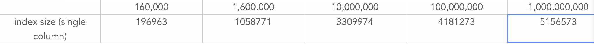

上次评审的主要问题：1）多个bitmap进行merge/split开销 2）index空间占用，膨胀率？

其中问题（1）通过与计算层协商做了一些限制，即计算层不使用过滤返回的bitmap做额外的计算，从而可以将BSI的计算过程下推到segment级别。所以剩下的问题就是评估在segment级别BSI的表现如何，也顺带回答问题（2）。

下面做了一组实验，场景是针对不同行数的segment，用10个segment来模拟一个结点级别的计算。分别通过 1）单线程扫描所有segment的某一列统计结果 2）把所有segment使用BSI进行过滤、聚合的结果进行统计，对比两种方式的耗时，并观察索引的空间占用。

图1上方单位为行数，数据单位微秒。图2上方单位为行数，数据单位为字节。

针对结果进行评审。