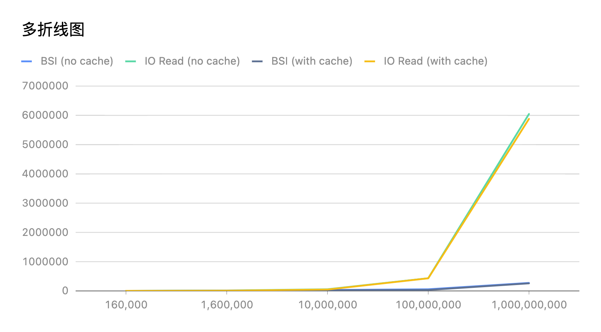
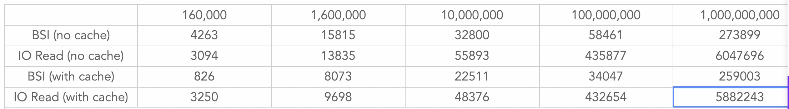
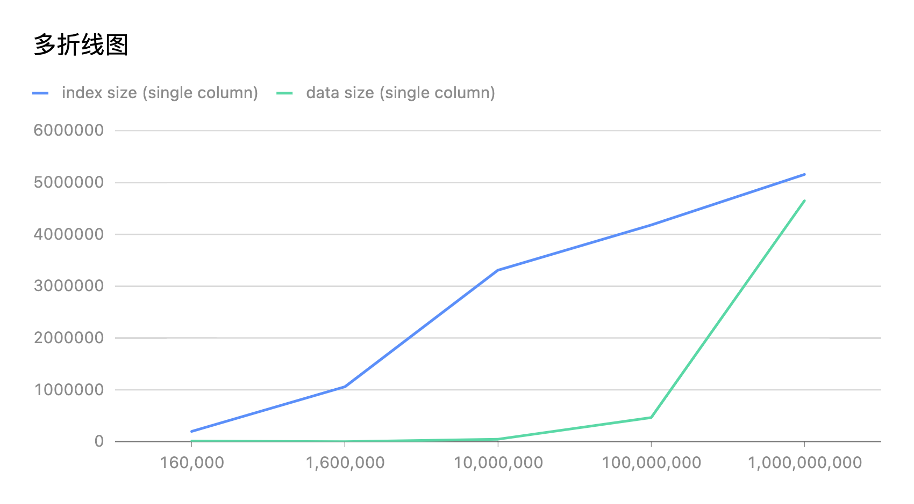
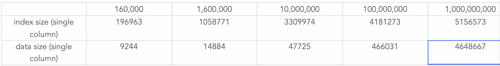

## BSI二次评审

上次评审的主要问题：1）多个bitmap进行merge/split开销 2）index空间占用，膨胀率？

其中问题（1）通过与计算层协商做了一些限制，即计算层不使用过滤返回的bitmap做额外的计算，从而可以将BSI的计算过程下推到segment级别。所以剩下的问题就是评估在segment级别BSI的表现如何，也顺带回答问题（2）。

下面做了一组实验，场景是针对不同行数的segment，用10个segment来模拟一个结点级别的计算。分别通过 1）单线程扫描所有segment的某一列统计结果 2）把所有segment使用BSI进行过滤、聚合的结果进行统计，对比两种方式的耗时，并观察索引的空间占用。

* **实验一：耗时对比**（单位为行数、微秒）

* **实验二：空间对比**（单位为行数、字节数）

需要注意的是，这里的数据文件指**仅包含一列**的segment文件，因为压缩友好所以可能导致数据文件偏小。考虑以下schema：[int8, int16, int32, int64]，根据这个schema生成的160万行segment为6,307,138 bytes，为这四列生成的BSI总大小为4,235,084 bytes，约占数据文件体积的67%。

